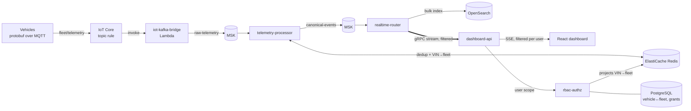

# Fleet telemetry platform

Vehicles report their position, status and battery charge over MQTT. The platform
cleans and enriches every report, stores it in OpenSearch, and pushes it within about
a second to a live map, but only to people allowed to see that vehicle.

Everything runs on AWS and is created by one script and removed by another:

```bash
./deploy.sh     # creates and starts everything, prints the dashboard URL and demo logins
./destroy.sh    # deletes everything
```

## How a position report travels



1. **Vehicles** publish a `telemetry.v1.VehicleTelemetry` protobuf (`proto/telemetry/v1`) to
   `fleet/telemetry`. Each vehicle is an IoT thing with its own X.509 certificate; the IoT policy
   lets a device connect only under its own thing name and publish only to that topic.
2. **IoT Core** invokes the **iot-kafka-bridge** Lambda for every message (a topic rule with a
   Lambda action; Floci's IoT rules can invoke Lambda but have no native Kafka action, so both
   targets use the same path). The function reads only the VIN, then republishes the original
   protobuf bytes to Kafka topic `raw-telemetry` unmodified, keyed by VIN so each vehicle's
   reports stay in one partition, with an `ingest_ts` header set to the receive time. Failed
   rule deliveries are logged to CloudWatch; exhausted async retries land in a dead-letter
   queue. Two accepted trade-offs: the Kafka key no longer proves which device sent a message
   (on AWS the IoT policy still binds each connection to its own thing), and async retries can
   reorder a vehicle's reports, which telemetry-processor's deduplication and the dashboard's
   newest-`deviceTimestamp`-per-VIN handling both tolerate.
3. **telemetry-processor** decodes and validates each message, drops duplicates using Redis,
   looks up the vehicle's fleet in Redis, and publishes JSON to `canonical-events`.
   Invalid messages go to `raw-telemetry-dlq`. Vehicles with no fleet are tagged `UNASSIGNED`.
4. **realtime-router** reads `canonical-events` twice, in two independent consumer groups:
   one pushes events to dashboard-api pods, the other bulk-indexes them into OpenSearch.
   Slow indexing can therefore never delay the live map.
5. **dashboard-api** holds each browser's Server-Sent Events connection and a gRPC stream to
   every realtime-router pod.
6. **rbac-authz** owns users, fleets, vehicles and grants in PostgreSQL, issues sign-in
   sessions, answers "what may this user see?", and keeps Redis's VIN→fleet map in sync.

### Only the right pods, only the right people

Each dashboard-api pod tells every router pod, over its gRPC stream, the union of what its
currently connected users may see: `all`, a set of fleet IDs, or a set of VINs. The router
sends an event only to pods whose interest matches it, so a pod with no connected user for a
fleet receives none of that fleet's traffic. The pod then checks each event again against
each individual user before writing it to their SSE stream. That second check is the
authoritative one; the first saves network and CPU.

When someone connects, disconnects, or has their grants changed (scopes are re-read every
60 seconds), the pod recalculates its interest and sends an update on the open streams.

Because every router pod consumes only some Kafka partitions, dashboard-api resolves the
router's headless Service and keeps a stream open to **each** pod, reconnecting as pods
come and go.

### Delivery guarantees

- **At least once, never lost.** telemetry-processor commits Kafka offsets only after the
  canonical events are acknowledged, and records deduplication keys only after that, so a
  crash replays rather than drops.
- **Idempotent storage.** Each event's ID is `VIN-deviceTimestamp` and is used as the
  OpenSearch document ID, so a replay overwrites instead of duplicating.
- **Live view favours freshness.** The push path starts at the newest offset, skips events
  older than 30 seconds, and drops updates for a slow browser rather than queueing them,
  since a newer position supersedes an older one.

## Repository layout

```
deploy.sh, destroy.sh     the only two scripts
proto/                    protobuf contracts: telemetry, router gRPC stream, authz gRPC
services/                 one Go module, six binaries (cmd/*), shared code in internal/
  Dockerfile              builds any service: --build-arg SERVICE=<name>
web/                      React + Leaflet dashboard, served by nginx
terraform/infra/          stage 1: VPC, EKS, MSK, ElastiCache, RDS, OpenSearch, IoT Core, ECR, IAM
terraform/platform/       stage 2: namespace, secrets, all Deployments/Services, NLB, simulator devices
```

Terraform is split in two because the container images must be built and pushed to ECR
after the registry and cluster exist but before the workloads that use them are deployed.

## Deploying

### Prerequisites

- An AWS account and credentials with administrator-level permissions (`aws sts get-caller-identity` works)
- Terraform 1.6 or newer
- AWS CLI v2
- Docker with Buildx (Docker Desktop includes it), running
- kubectl, curl

No Go, Node or protoc toolchain is needed on your machine. Code generation and compilation
happen inside the Docker builds.

### Run it

```bash
./deploy.sh
```

Optional settings:

| Variable | Default | Meaning |
|---|---|---|
| `AWS_REGION` | `us-west-2` | Region to deploy into |
| `PROJECT` | `fleet-telemetry` | Prefix for all resource names |
| `RESTRICT_TO_MY_IP` | off | `1` limits the EKS API and dashboard to your current public IP |
| `IMAGE_TAG` | git SHA + time | Tag for built images |

For anything else, create `terraform/infra/terraform.tfvars` or
`terraform/platform/terraform.tfvars` (see each stack's `variables.tf`), for example:

```hcl
# terraform/platform/terraform.tfvars
simulated_vehicle_count = 40
simulator_center        = { lat = 52.52, lng = 13.405 }  # Berlin
```

A first deployment takes roughly 45–60 minutes; MSK and OpenSearch account for most of it.
Re-running is safe and much faster: it rebuilds images under a new tag and rolls the pods.

When it finishes it prints the dashboard URL and the shared demo password.

### Demo users

| User | Sees |
|---|---|
| `admin` | every fleet |
| `north-manager` | fleet North |
| `south-viewer` | fleet South |
| `vehicle-viewer` | two individually granted vehicles |

The simulator drives 12 vehicles around San Francisco, spread across three fleets. Open the
dashboard as two users in separate browser profiles to watch the filtering in action.
About 3% of reports are deliberately sent twice to exercise deduplication.

Admins can reassign a vehicle or grant access while streams are open; changes reach
Redis immediately and open dashboards within a minute:

```bash
URL=http://<dashboard_url>
curl -c jar -H 'content-type: application/json' \
  -d '{"username":"admin","password":"<password>"}' $URL/auth/login
curl -b jar -H 'content-type: application/json' \
  -d '{"vin":"SIM00000000000001","fleetId":"fleet-east"}' $URL/admin/vehicles
curl -b jar -H 'content-type: application/json' \
  -d '{"userId":"u-south","fleetId":"fleet-east"}' $URL/admin/grants
```

## Destroying

```bash
./destroy.sh          # asks you to type "destroy"
./destroy.sh --yes    # no prompt
```

It removes the platform stack first (the dashboard NLB, workloads, IoT things and
certificates), waits for AWS to finish deleting the load balancer, then removes the
infrastructure. It retries automatically because AWS releases some network interfaces
minutes after their owner is deleted. If interrupted, run it again.

Two things intentionally outlive it: KMS keys wait the AWS-mandated 7 days before deletion,
and the account-wide OpenSearch service-linked role is kept if other OpenSearch domains in
the account still use it.

## Cost

With default sizes in us-west-2, on-demand pricing, the stack costs roughly **$0.84 per hour
(about $610 per month)** before data transfer. The largest items are the EKS nodes
(3 × t4g.large, 2 × t4g.medium — Graviton, about 20% cheaper than the equivalent t3 sizes),
MSK (3 brokers), the EKS control plane, OpenSearch and ElastiCache. Run `./destroy.sh` when
you're done.

## Running on Floci

The same code and the same two scripts also run against [Floci](https://floci.io), a local
AWS emulator, for development without any AWS cost. `deploy.sh` never starts Floci itself —
it expects one already running and configured, and tells you exactly what's missing if not:

```bash
TARGET=floci ./deploy.sh
```

Required before running it: Floci itself, started with its real MQTT broker turned on and
reachable from pods. The `floci` CLI (`floci start`) has no flag or profile field for either of
those, so start the container directly instead:

```bash
docker run -d --name floci \
  -v /var/run/docker.sock:/var/run/docker.sock \
  -v floci-data:/app/data \
  -p 4566:4566 -p 1883:1883 -p 8883:8883 \
  -e FLOCI_SERVICES_IOT_MQTT_AUTO_START=true \
  floci/floci:latest /app/application -Dquarkus.http.host=0.0.0.0
```

Without `FLOCI_SERVICES_IOT_MQTT_AUTO_START=true`, Floci's MQTT broker never starts: it
listens on nothing, `vehicle-simulator`'s connections retry forever without ever surfacing an
error (confirmed on a live run — PLAN.md Phase 4), and no telemetry ever reaches Kafka. Without
the `-p 1883:1883 -p 8883:8883` mappings the broker has no port to listen on even once started.
`deploy.sh` checks both (via `docker inspect floci`, since Floci exposes no API for this) and
fails with this exact command if either is missing — it never starts or reconfigures Floci
itself.

Also required:

- Floci reachable (default `http://localhost:4566`; override with `FLOCI_ENDPOINT`).
- Docker Desktop with roughly 12 GB of memory available.

What's different on Floci, all switched by the same `target` Terraform variable: one broker
each for MSK, ElastiCache and OpenSearch, no NAT gateway, no EKS node groups (k3s runs every
pod on its single node), plaintext Kafka and Redis, one replica per service, and the
dashboard reachable by port-forward instead of a load balancer:

```bash
kubectl -n fleet port-forward svc/web 8080:80   # deploy.sh prints this exact command
```

Tear it down the same way, targeting the same Floci:

```bash
TARGET=floci ./destroy.sh   # Floci itself keeps running
```

A few pieces of this are best guesses until verified against a real Floci run (see PLAN.md
Phase 4): OpenSearch's scheme/port, whether pods can resolve the addresses Floci hands back
for MSK/RDS/ElastiCache/OpenSearch, and the ECR registry hostname's exact form. `deploy.sh`
will fail with a clear error at whichever step needs a fallback if one of these doesn't hold.

## Local dashboard development

Point the Vite dev server at a deployed stack; it proxies `/api` and `/auth`:

```bash
cd web
npm install
API_TARGET=http://<dashboard_url> npm run dev
```

## Operating it

```bash
kubectl -n fleet get pods
kubectl -n fleet logs -l app=telemetry-processor -f
kubectl -n fleet logs -l app=realtime-router -f
aws logs tail /aws/iot/fleet-telemetry/rule-errors --follow   # IoT → Lambda invoke failures
```

Every Go service serves `/healthz`, `/readyz` and Prometheus `/metrics` on port 8081
(pods carry `prometheus.io/scrape` annotations). Useful metrics:

| Metric | Tells you |
|---|---|
| `telemetry_processor_records_total{outcome}` | processed, duplicate, invalid (to DLQ) |
| `realtime_router_events_delivered_total` / `_dropped_total` / `_unrouted_total` | push fan-out health; unrouted means no connected user may see it |
| `realtime_router_indexed_total{outcome}` | OpenSearch indexing |
| `dashboard_router_streams` | should equal the number of router pods, per dashboard-api pod |
| `dashboard_sse_clients`, `dashboard_sse_dropped_total` | connected browsers, updates dropped for slow ones |

### Troubleshooting

**The map stays empty.** Check the chain in order. Simulator:
`kubectl -n fleet logs deploy/vehicle-simulator`. IoT rule delivery: the rule-errors log
group above. Processor: `kubectl -n fleet logs -l app=telemetry-processor`. If events are
processed but not shown, confirm the signed-in user has a grant for that fleet.

**Vehicles show as "Unassigned".** The VIN isn't in PostgreSQL, or rbac-authz hasn't synced
it to Redis yet (it syncs every 30 seconds and immediately on admin changes).

**Sign-in works but live updates don't arrive.** Something between the browser and nginx is
buffering the SSE response. nginx is configured not to; corporate proxies sometimes do.

**`deploy.sh` fails partway.** Fix the reported problem and run it again; finished steps
are skipped.

## Before production

This is a complete working platform, sized and configured for a demo. For production:

- **TLS for the dashboard.** Attach an ACM certificate to the NLB (or use the AWS Load
  Balancer Controller with an ALB), then set `COOKIE_SECURE=true` for rbac-authz. The
  session cookie is not marked Secure today because the demo is served over HTTP.
- **Real identities.** Replace the seeded demo users (`SEED_DEMO_DATA=false`) with your
  identity provider; rbac-authz's grant model stays the same.
- **Shared Terraform state.** Both stacks use local state files, which suits one person.
  For a team, switch both `backend "local"` blocks to `backend "s3"` with state locking, and
  change the platform stack's `terraform_remote_state` to read the infra state from S3.
- **Sizing.** Move MSK, OpenSearch and ElastiCache off burstable `t3`/`t4g` instances,
  add OpenSearch dedicated masters and an index lifecycle policy, and enable RDS Multi-AZ,
  deletion protection and final snapshots.
- **Restrict access.** Set `eks_public_access_cidrs` and `dashboard_allowed_cidrs` to your
  networks (or run with `RESTRICT_TO_MY_IP=1`).
